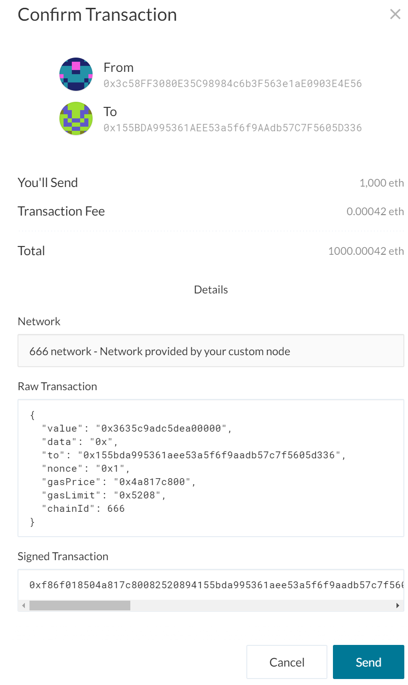
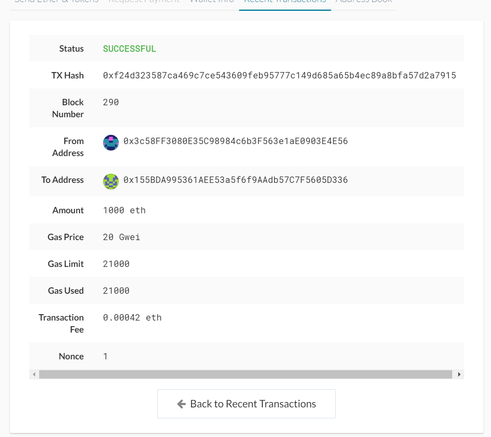

# Unit18Homework

## ZBANK CRYPTO NETWORK 

This projects sets up a private testnet for developers at ZBANK to explore potentials for blockchain at ZBank.


### Environment Setup 

* Install [Go Ethereum](https://geth.ethereum.org/)
* Navigate to the installation folder in GitBash
* Download and Copy the folders below:
    * [zbank](./NetworkFiles/zbank) 
    

### Network Setup / Genesis Block Initialisation

To start the network, execute the command below:

 ```bash
  ./geth  init  zbank/zbanknetwork.json
  ```

### Node Setup 

* This network has two nodes - ***ZBankAcc1*** and  ***ZBankAcc2***

 > ***Do not loose the passwords you set***
 ```bash
./geth account new --datadir ZbankAcc1
./geth account new --datadir ZbankAcc2
```
 > Take a note of the Public address of the key and Secret Keyfile paths
   
### Start the nodes

***ZBankAcc1*** is the main node and started as a miner  using the command:

 ```bash
  ./geth --datadir ZBankAcc1 --unlock <<ZBankAcc1 Public Address>> --mine --rpc --allow-insecure-unlock --snapshot=false
  ```
>  Copy the with the **enode address and port**  from the terminal,

***ZBankAcc@*** is the also and started as a miner  using the command:

 ```bash
  ./geth --datadir ZBankAcc2 --unlock 0x155BDA995361AEE53a5f6f9AAdb57C7F5605D336 --mine --port 30304 --bootnodes "enode://<enode address and node from above>>" --ipcdisable --allow-insecure-unlock --snapshot=false

  Example:
  ./geth --datadir ZBankAcc2 --unlock 0x155BDA995361AEE53a5f6f9AAdb57C7F5605D336 --mine --port 30304 --bootnodes "enode://3d2d8fbbec36567877b0ee2acaefd95681d1fb3ba228d4a7ca877014fd6440a684567076ac9c217b9f263218d78950975eab13dea4c1fe39b25774fa530bee98@127.0.0.1:30303" --ipcdisable --allow-insecure-unlock --snapshot=false
  ```
The flags provided  to geth are:

    * datadir - the name of the node you want to start
    * unlock - the public address of the node to unlich 
    * mine - this node will mine coins 
    * rpc - opens a port to listen on 
    * allow-insecure-unlock - this allows for a local HTTP communication based account unlock   
    * bootnodes - the address to connect to in the network, given to the second node 


### Connect  Wallet to the Network 
 In the MyCrypto app, slelect Change Network and click on Add Custom Node.
 Create a bank node as per the image below:

 

 On the main page of the wallet, click on Keystore file and load the keystore for ZBankAcc1 as per the keystore file destination provided when you created the node, with the password. 

### Transactions 

Send the transactions to ZBankAcc2 from your wallet to test the fucntionality by entering the public address of ZBankAcc2 in the To Address field.

### Screenhshots

#### Network Creation 


----

#### Account Creation 


----

#### Enode Details from first Node


----

#### Custom Node


----

### Balance Check 


----

### Transfer Funds 



----
### Validation

Upload the code, including the networkname.json and node folders.

----

## All Network Files
[NetworkFolder](./NetworkFiles)


***Reach out if you need passwords***
